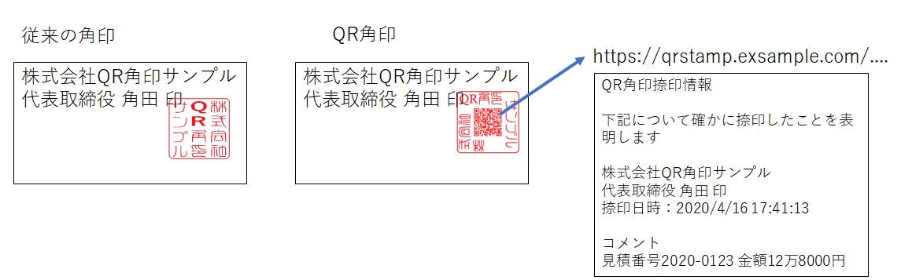

# QR角印とは？

> WHAT IS "QR Stamp" ?
>
> "QR Stamp" is a digital seal designed as an alternative to Japanese so called "square stamps".

## QR角印は電子印鑑です

- 日本の企業間取引において書類の正当性を表明する「認印」として広く使われる、
- いわゆる「角印」の代替となるべく開発された、電子印鑑です
  - 電子印鑑システム全体、あるいはシステムによって生成された印影を意味します

## 角印の代わりに使えます

中心のQRコードを組織名で囲み、従来の角印に似通った、同じサイズ（約21mm四方）のデザインです。

- 印影の中央にQRコードを持つことが外見上の特徴ですが
- 人の目で見ても、社名が一目瞭然で、角印の代わりに運用できます
- 一定の役職者のみが印影をその都度生成し、生成された画像ファイルを文書中に貼り込んで使います
- 印影は生成のたびに毎回異なるユニークなQRコードを含みます

## 書類に一定の信頼性を付加します

- 中心のQRコードが、有効なURLとして捺印情報Webページへのリンクとなっています。

- スマホやタブレットでQRコードを読み取れば、捺印情報ページで書類の信頼性を監査できます。

- 以下のような観点から書類の監査が可能です

  - 捺印情報ページが有効であるかどうか？

  - 捺印情報ページのドメインは書類の発行者が所有するインターネットドメインかどうか？

  - 捺印情報の内容（日付時刻・組織名やコメントなど）が書類の内容と矛盾しないかどうか

    

## 関連文書

#### QR角印考案の動機 [00_MOTIVATION.md](./docs/00_MOTIVATION.md)

#### QR角印標準 [10_QR_STAMP_STANDARDS.md](./docs/10_QR_STAMP_STANDARDS.md)

#### インストール・設定手順 [20_HOW_TO_DEPLOY.md](./docs/20_HOW_TO_DEPLOY.md)

#### AWS EC2への導入例 [30_AWS_EC2_DEPLOYMENT.md](./docs/30_AWS_EC2_DEPLOYMENT.md)

