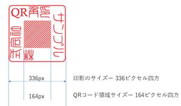
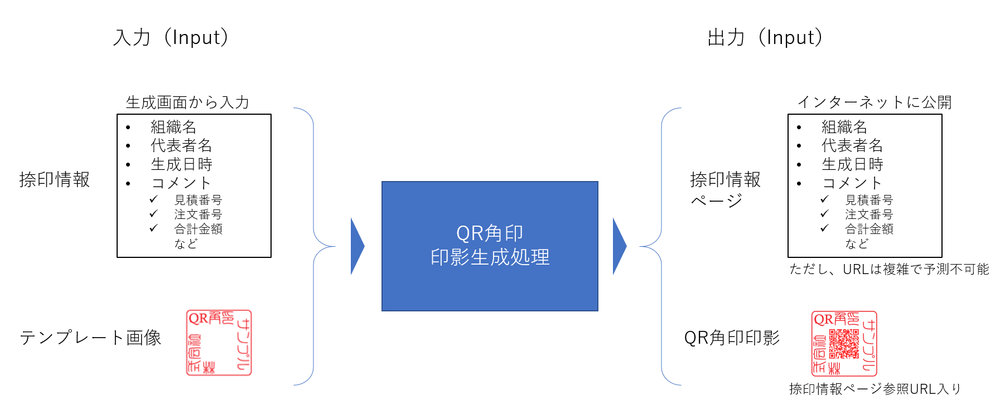
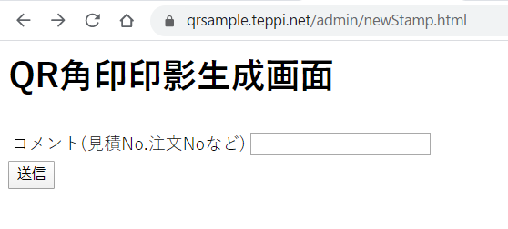
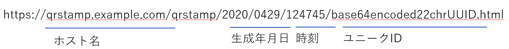

# QR角印標準

## 印影の外見に関する標準

- 紙の上での印影のサイズは、従来の角印同様に、21mm四方とします

- 原則として白地の背景の上に、赤に近い色で印字します。

   - 会社名・組織名のデザイン部の色については、従来の朱肉の色に近い色で作成してください。
   - QRコードデータ部については、原則としてRGB=＃3F0000で描画します
   - テンプレート画像は正方形で作成してください。（必須要件）
      全体を16分割した中央の４区画が、QRコード領域になり、
      周辺の12区画の部分に、会社名を入れてデザインしてください。

- QRコード部は 41セル収容可能なサイズが必要です

  QRコード Type1 バージョン6 英数モード（誤り訂正レベルL）です

### サンプル実装用のテンプレート画像作成ヒント

サンプル実装のQR角印システムは、PNG画像形式のテンプレート画像を利用します

- テンプレート画像は、縦横 336px 四方の画像として作成してください

  - このサイズで、QRコードの1セルを4px四方として41セル収容可能です

- テンプレートは、透過色を扱えるPNG画像フォーマットで作成してください

  #### レイアウトサンプル

  l 

Adobe Illustrator などのDTPソフトでテンプレート画像を作成する場合、キャンバスサイズは21mm×21mmで作成し、周囲は角を丸くした四角形で囲みます。

篆書フォントなどでデザイン区画をデザインします。（世の中には、フリーの篆書フォントなどがあります、探してみましょう。）

できあがったら、PNGファイルにエクスポートします。このとき、出力する画像のサイズ（336px×336p）および透過色を指定して出力します。

## 運用シナリオ

QR角印は下記のように運用します

### システム構成

QR角印システムは下記の二つで構成されます

#### QR角印 印影生成機能

- ユーザ組織の限られたユーザ（捺印権限者）のみが印影生成できるものとします

#### QR角印 捺印情報公開機能

- QR角印の印影中のQRコードは、インターネットに公開されるHTMLページの有効なURLであり、当該ページには、捺印者・捺印日時および、印影生成時に捺印者が入力したコメントが記録されています。有効なQR角印をスマホなどで読み取れば、この捺印情報にアクセス可能です。

### 1 ― 捺印時のワークフロー

1. #### 文書作成（Microsoft Officeなど）

   ユーザはこれまで通りに、文書を作成します

2. #### QR角印印影生成

   捺印権限者は、QR角印システムの印影生成画面にアクセスし、コメントを入力の上、「生成」ボタンを押します。すると、QR角印の印影が生成されます。

   生成された印影がブラウザ上に表示されるので、これを「コピー」してクリップボードに画像を取り込みます。（名前をつけて保存してもかまいません）

3. #### 捺印済文書作成

   クリップボードに取り込んだ印影画像を、文書に貼り付けて、**捺印済文書として**、保存します。

   1. Microsoft WordやExcelの文書に貼り付けても良いでしょう
   2. 一度PDFとして出力されたものに、Annotationとして印影画像を追加してもよいでしょう
   3. あるいは、社内システムに組み込んで印影生成から文書への挿入までを自動化してもよいでしょう。（PDFやOffice文書に画像を埋め込むプログラミングが必要です）

4. #### 捺印済文書を送付

   上記のように作成された捺印済文書を、相手に送付します。

   1. 従来通り、印刷して郵送してもよいでしょう
   2. PDFとして電子メールに添付して送付してもよいかもしれません
   3. PDFデータを送付して書類の印刷・郵送を行うアウトソースサービスを利用すれば、さらなる省力化も可能です

   ##### 印刷の色および解像度についての注意

   - 原則として、できるだけ高解像度でカラー印刷してください

     低解像度でモノクロ印刷した場合には、QRコードの読み取りが困難になります。

   - FAX送信による運用は推奨しません。FAXが「低解像度」かつ「モノクロ」であるためです。

     やむを得ずFAXで運用する場合には、QR角印画像の大きさを拡大したり、QRコードのデータ部の色を完全な白黒にするなどして、読取りやすくなるように工夫しなければなりません。

   

### 2 ― 監査時のワークフロー

QR角印の印影が添付された文書について、当該印影の正当性を確認したい場合には、スマートフォンやタブレットのカメラでQR角印の印影中央のQRコードを撮影し、コードを読み取ります

- QR角印の印影には、捺印情報公開WebページのURLが含まれます
  1. 有効なQR角印を読み取ったならば、捺印情報を参照できるでしょう
  2. 文書の発行日からの経過期間が十分短いにもかかわらず、捺印情報ページが見つからない（404 Not Found）場合、このQR角印は偽造されていたり、不正にコピーされている可能性が高いといえます。（一般的には、捺印情報ページの保存期間は最低でも1年以上、できれば数年間とすべきでしょう。）
  3. 捺印情報ページに記されたコメント情報の注文番号・見積番号などと、実文書の注文番号・見積番号などが不一致あるいは矛盾する場合にも、このQR角印が不正利用されている可能性が高いといえます。

- 社内の捺印権限者は、定期的に発行済の捺印情報を一覧し、不正発行がないかを確認します

  身に覚えのない捺印情報が作成されていれば、不正アクセス防止策を講じたり、実施者を調査したりなどの対策をとることができます

## 捺印情報について

捺印情報とは、QR角印の印影生成画面で入力する各種情報に、印影の生成日時や作成者名などを加えた情報のことです。

QR角印システムは、印影を生成すると同時に、捺印情報ページを生成します。その関係は下図の通りです。

捺印情報ページは、下記のような外見をしています

サンプル実装における印影生成画面では、コメントという１項目を文字列で入力するようになっていますが、実運用においては、文書種類を選択し、その種類に応じた必須情報の入力を求めるようにするとよいと考えます。

これは、捺印情報が、捺印済文書の監査の手がかりとなるためです。

- たとえば見積書に捺印するときは、見積番号と合計金額をコメントに入力することにしたり
- 納品書に捺印する場合には、注文番号や納品先などの情報を捺印情報に含めたり

という具合に、捺印情報の充実を図ることが考えられます。

## 捺印情報ページURL

QRコードとして41セル以内におさまっていれば構いませんが、サンプル実装における捺印情報ページのURLは、下記のような形式です

- QR角印のサンプル実装では、上記のようなURLを生成します

  - 時刻は秒単位であり、1秒間に2件以上生成しないと想定しています
  - ランダムに生成されるユニークIDを必ず含め、QRコードをスキャンする以外の方法で捺印情報ページにたどり着くことを事実上困難にします

- QRコード Type1 バージョン6 英数モード（誤り訂正レベルL）で195文字まで表現可能です。

  この範囲内であれば、URLの形式は任意。QRコードの英数（ALPHANUMERIC）モードでは記号「$%*+-/:」も使えます（URLエンコード不要）

